# Linux基础_01_基础

## 环境

* linux 选择：[rockyLinux](https://rockylinux.org/zh_CN/)
* 虚拟机静态ip地址:  `192.168.56.90`
* 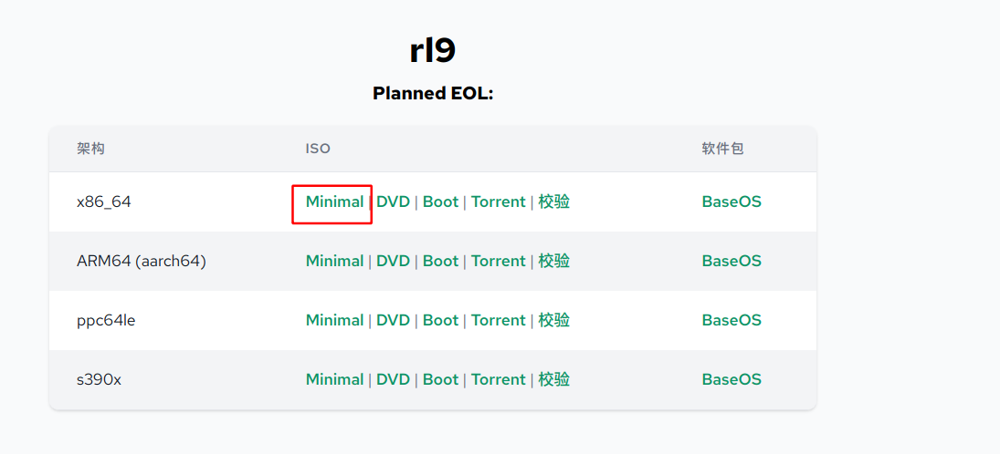

## 安装

  ### 大致步骤

* 下镜像
* 配置虚拟机
* 进入安装界面
* 安装

   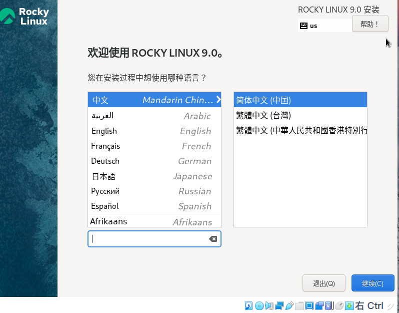

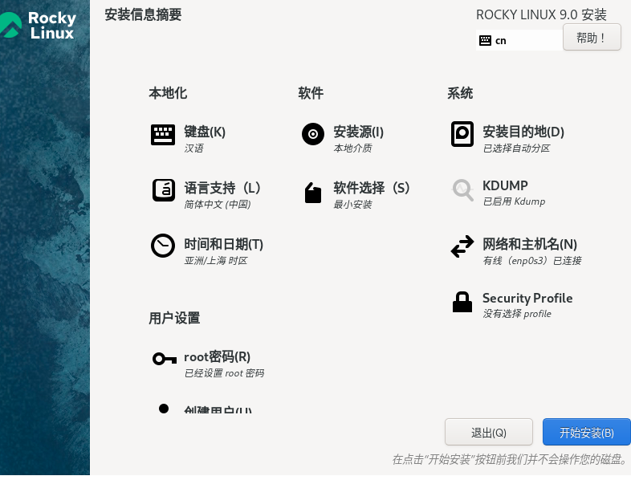

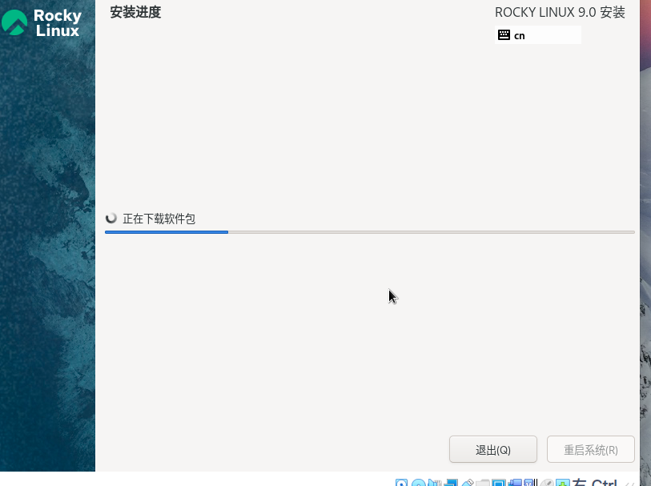

添加`Host-Only`网络，固定虚拟机内部ip。


### 虚拟机设置静态Ip
#### 全局添加NAT网络

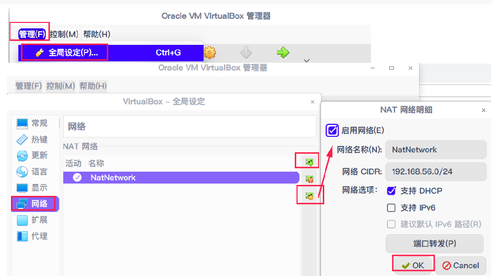


#### 管理网络

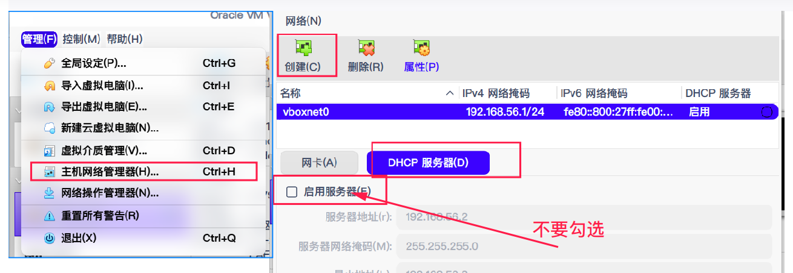


#### 虚拟机编辑网络

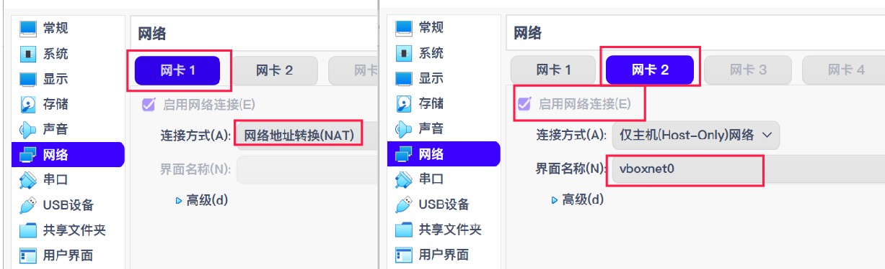

虚拟机添加两张网卡，`NAT + Host-Only`  。 

 

#### 虚拟机里面固定ip

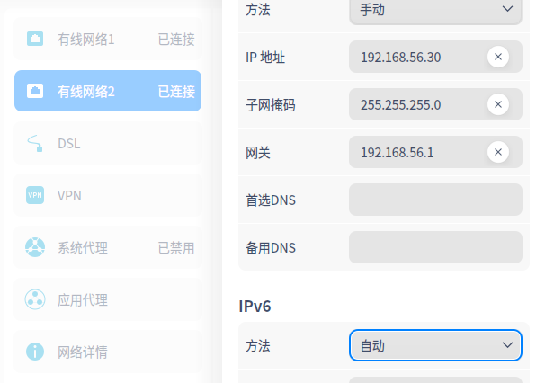

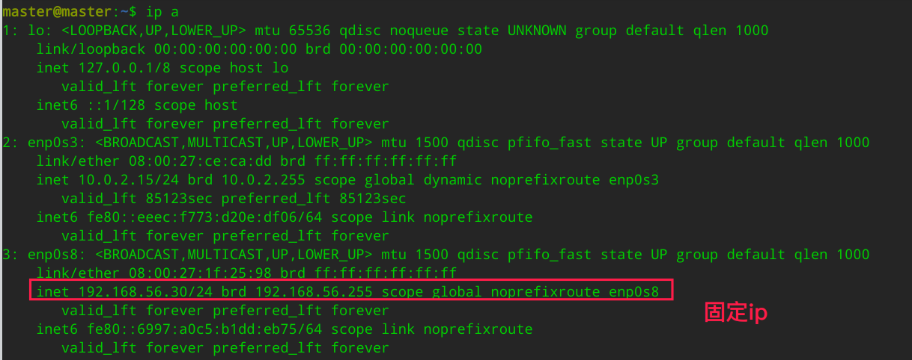

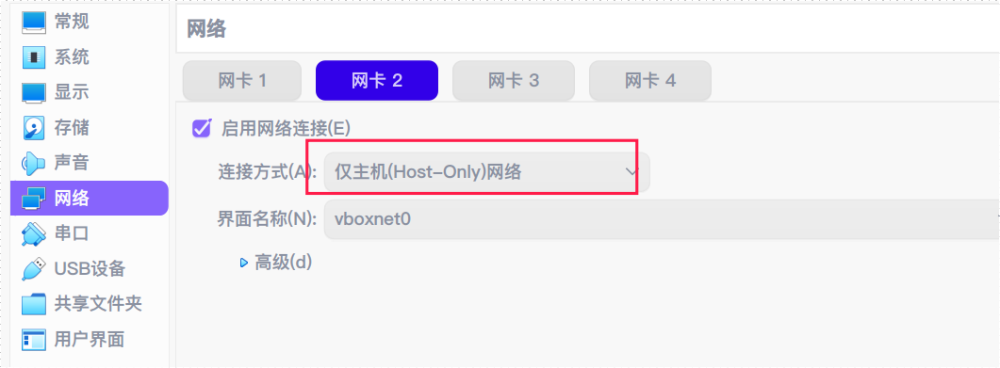

由于是最小化安装，这里采用命令方式固定：

```shell
# 查看添加的仅主机网卡是 enp0s8
# 使用nmcli添加ip
nmcli con add con-name nwnet ifname enp0s8 type ethernet ip4 192.168.56.90/24 gw4 192.168.56.1

# 重启
systemctl restart NetworkManager

#检查ip 
3: enp0s8: <BROADCAST,MULTICAST,UP,LOWER_UP> mtu 1500 qdisc fq_codel state UP group default qlen 1000
    link/ether 08:00:27:da:f1:1f brd ff:ff:ff:ff:ff:ff
    inet 192.168.56.90/24 brd 192.168.56.255 scope global noprefixroute enp0s8
       valid_lft forever preferred_lft forever
    inet6 fe80::d417:c022:d502:95c2/64 scope link noprefixroute 
       valid_lft forever preferred_lft forever

```


## 基础01

### ssh远程连接linux

大致步骤：

* 打开终端或者其他ssh软件
* 输入帐号以及地址进行连接

以linux为例：

```shell
[kala@uosPro ~]$ ssh root@192.168.56.90
The authenticity of host '192.168.56.90 (192.168.56.90)' can't be established.
ECDSA key fingerprint is SHA256:aLVx2w+canbWZzOLbpZ0GgCBrKmvwe2/rPTKq938imY.
Are you sure you want to continue connecting (yes/no)? yes
Warning: Permanently added '192.168.56.90' (ECDSA) to the list of known hosts.
root@192.168.56.90's password: 
Last login: Sat Jul 16 12:33:13 2022
[root@localhost ~]# 
```

第一次连接的时候为了验证安全性，需要输入`yes`然后输入密码进行连接。下面来详细说一下这个过程。

### 终端

刚刚说远程连接的时候需要用终端或者其他的ssh终端软件去连接。那么什么是终端呢？ 简单来说终端就是一个输入输出的一个设备，连接用户和系统的一个桥梁。接受用户输入的操作命令，并将命令交给系统去执行。

根据输入输出设备这个概念来讲，图形界面也是一种终端。其实终端有很多装，图形界面是最常见的一种。除了图形和远程的终端系统还自带了6个伪终端。使用`CTRL ALT F1.。6` 即可切换。


### 终端的默认显示 

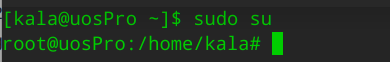


有两种默认的显示，第一种：

* [用户名@主机名  当前路径]$ 
* [用户名@主机名  当前路径]#

这个叫做`PS1`， 是一个环境变量。默认的设置就是`[用户名@主机名  当前路径]用户` , 这个设置是可以在`/etc/profile`环境变量文件中看到的。

```shell
# 如果 ps1变量不为空
if [ "$PS1" ]; then
  # 如果bash不为空并且bash 不等于/bin/bash
  if [ "$BASH" ] && [ "$BASH" != "/bin/sh" ]; then
    # The file bash.bashrc already sets the default PS1.
    # PS1='\h:\w\$ '
    # 如果/etc/bash.bashrc文件存在
    if [ -f /etc/bash.bashrc ]; then
      # 执行 /etc/bash.bashrc 文件
      . /etc/bash.bashrc
    fi
  else
    # 如果bash为空并且是/bin/bash 并且 用户的id 等于0
    if [ "`id -u`" -eq 0 ]; then
       # ps1就等于#
      PS1='# '
    else
      # 如果不是root用户就是$符号
      PS1='$ '
    fi
  fi
fi

# 看一下/etc/bash.bashrc文件
# 文件作用：
#为每一个运行bash shell的用户执行此文件.当bash shell被打开时,该文件被读取.如果你想对所有的使用bash的用户修改某个配置并在以后打开的bash都生效的话可以修改这个文件，修改这个文件不用重启，重新打开一个bash即可生效。

root@uosPro:/home/kala# cat /etc/bash.bashrc
# System-wide .bashrc file for interactive bash(1) shells.
# To enable the settings / commands in this file for login shells as well,
# this file has to be sourced in /etc/profile.

# If not running interactively, don't do anything、
# 如果不已交互式运行shell，则不做任何事情
#  如果PS1字符串为空，则不继续执行
[ -z "$PS1" ] && return

# check the window size after each command and, if necessary,
# update the values of LINES and COLUMNS.
# 判断终端大小，如果有必要就更新一下终端的lines和columns的值  shell options  shopt  
shopt -s checkwinsize


# set variable identifying the chroot you work in (used in the prompt below)
# 设置变量用于标识工作路径
if [ -z "${debian_chroot:-}" ] && [ -r /etc/debian_chroot ]; then
    debian_chroot=$(cat /etc/debian_chroot)
fi

# set a fancy prompt (non-color, overwrite the one in /etc/profile)
#
# but only if not SUDOing and have SUDO_PS1 set; then assume smart user.
if ! [ -n "${SUDO_USER}" -a -n "${SUDO_PS1}" ]; then
  PS1='${debian_chroot:+($debian_chroot)}\u@\h:\w\$ '
fi

# Commented out, don't overwrite xterm -T "title" -n "icontitle" by default.
# If this is an xterm set the title to user@host:dir
case "$TERM" in
xterm*|rxvt*)
    PROMPT_COMMAND='echo -ne "\033]0;${USER}@${HOSTNAME}: ${PWD}\007"'
    ;;
*)
    ;;
esac

# enable bash completion in interactive shells
#if ! shopt -oq posix; then
#  if [ -f /usr/share/bash-completion/bash_completion ]; then
#    . /usr/share/bash-completion/bash_completion
#  elif [ -f /etc/bash_completion ]; then
#    . /etc/bash_completion
#  fi
#fi

# if the command-not-found package is installed, use it
if [ -x /usr/lib/command-not-found -o -x /usr/share/command-not-found/command-not-found ]; then
        function command_not_found_handle {
                # check because c-n-f could've been removed in the meantime
                if [ -x /usr/lib/command-not-found ]; then
                   /usr/lib/command-not-found -- "$1"
                   return $?
                elif [ -x /usr/share/command-not-found/command-not-found ]; then
                   /usr/share/command-not-found/command-not-found -- "$1"
                   return $?
                else
                   printf "%s: command not found\n" "$1" >&2
                   return 127
                fi
        }
fi

```

### shopt

使用`shopt`命令可以查看bash支持的属性及是否开启

| 选项 | 说明                                |
| ---- | ----------------------------------- |
| -p   | 打印每个 shell 选项并标注它的状态。 |
| -s   | 开启设置                            |
| -u   | 关闭设置                            |

查看：

```shell
[kala@uosPro ~]$ shopt
autocd          off
assoc_expand_once       off

#  如果给cd内置命令的参数不是一个目录,就假设它是一个变量名,变量的值是将要转换到的目录
cdable_vars     off
# 纠正cd命令中目录名的较小拼写错误.检查的错误包括颠倒顺序的字符,遗漏的字符以及重复的字符.如果找到一处需修改之处,正确的路径将打印出,命令将继续.只用于交互式shell
cdspell         off
#[kala@uosPro ~]$ cd /ect
#bash: cd: /ect: 没有那个文件或目录
#[kala@uosPro ~]$ shopt -s cdspell
#[kala@uosPro ~]$ cd /ect
#/etc
#[kala@uosPro etc]$ 

# bash在试图执行一个命令前,先在哈希表中寻找,以确定命令是否存在.如果命令不存在,就执行正常的路径搜索
checkhash       off
checkjobs       off


# bash在每个命令后检查窗口大小,如果有必要,就更新LINES和COLUMNS的值
checkwinsize    on

# bash试图将一个多行命令的所有行保存在同一个历史项中.这是的多行命令的重新编辑更方便
cmdhist         on


compat31        off
compat32        off
compat40        off
compat41        off
compat42        off
compat43        off
compat44        off
complete_fullquote      on
direxpand       off
dirspell        off
dotglob         off
execfail        off
expand_aliases  on
extdebug        off
extglob         off
extquote        on
failglob        off
force_fignore   on
globasciiranges on
globstar        off
gnu_errfmt      off


histappend      off
histreedit      off
histverify      off


hostcomplete    on
huponexit       off
inherit_errexit off
interactive_comments    on
lastpipe        off
lithist         off
localvar_inherit        off
localvar_unset  off
login_shell     off
mailwarn        off
no_empty_cmd_completion off
nocaseglob      off
nocasematch     off
nullglob        off
progcomp        on
progcomp_alias  off
promptvars      on
restricted_shell        off
shift_verbose   off
sourcepath      on
xpg_echo        off

```

